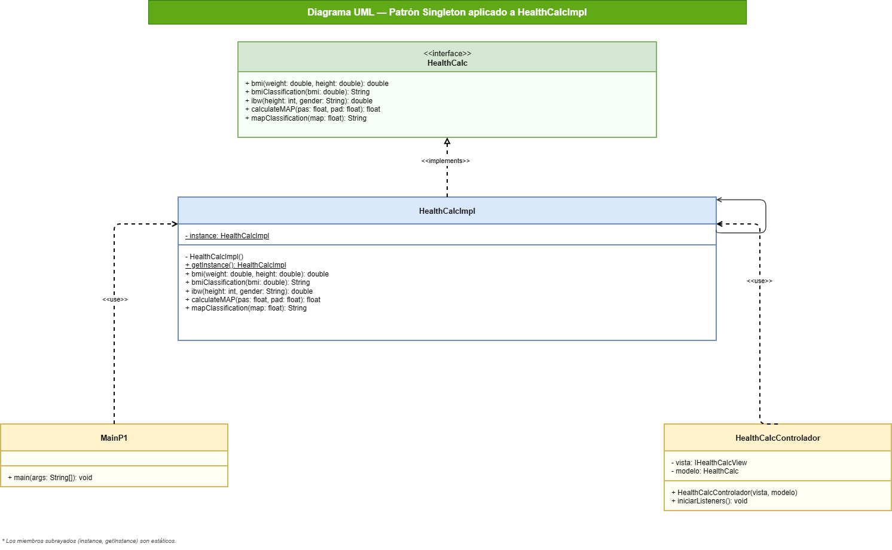
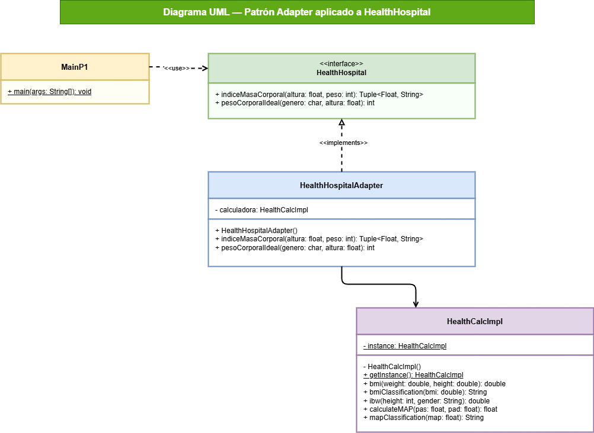
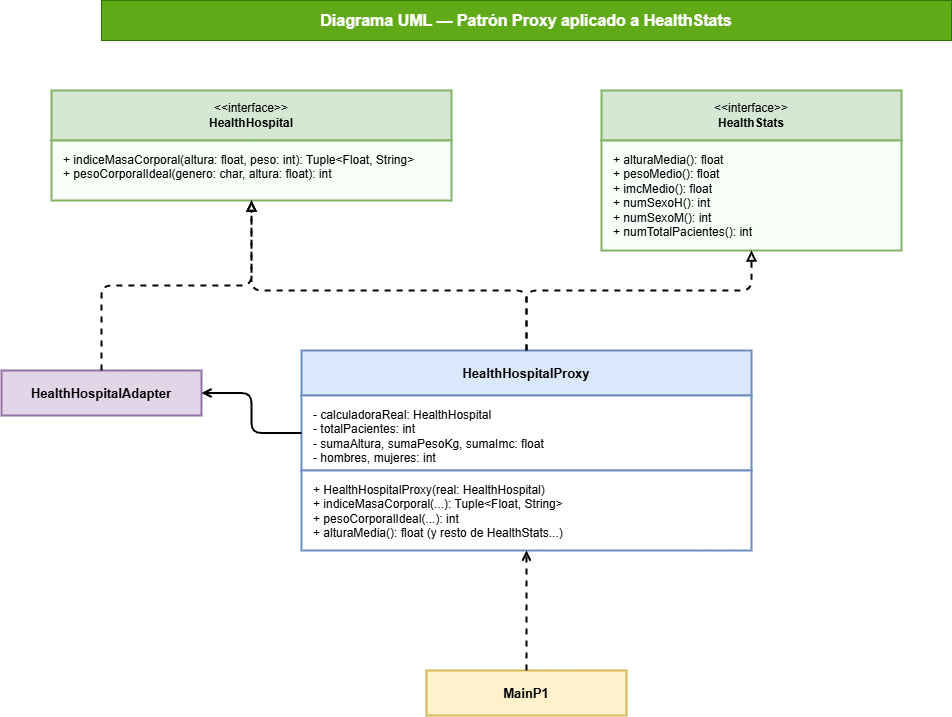
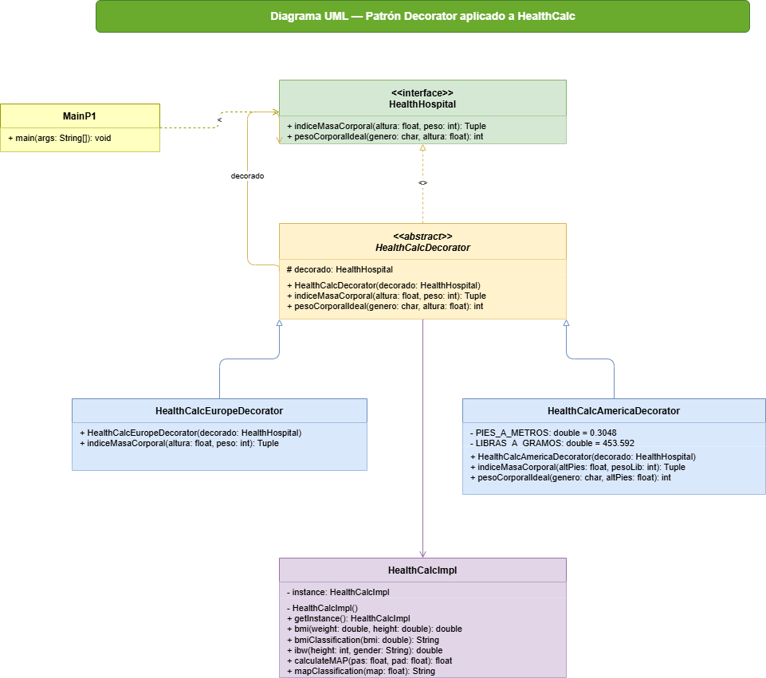
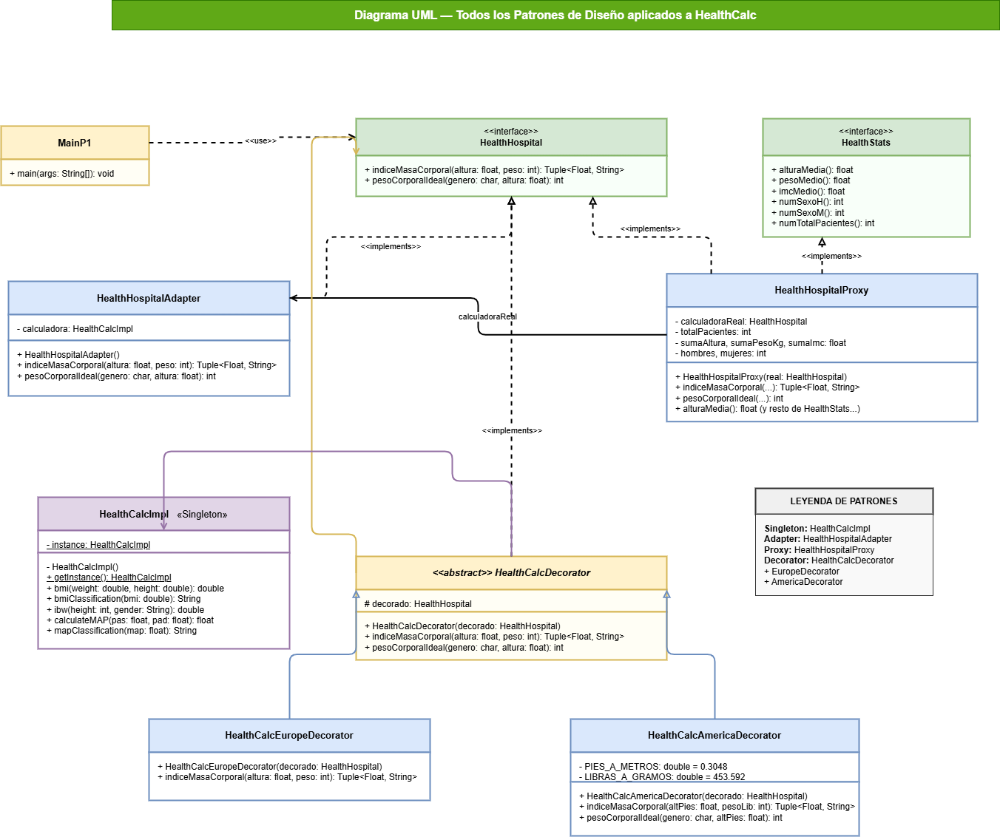
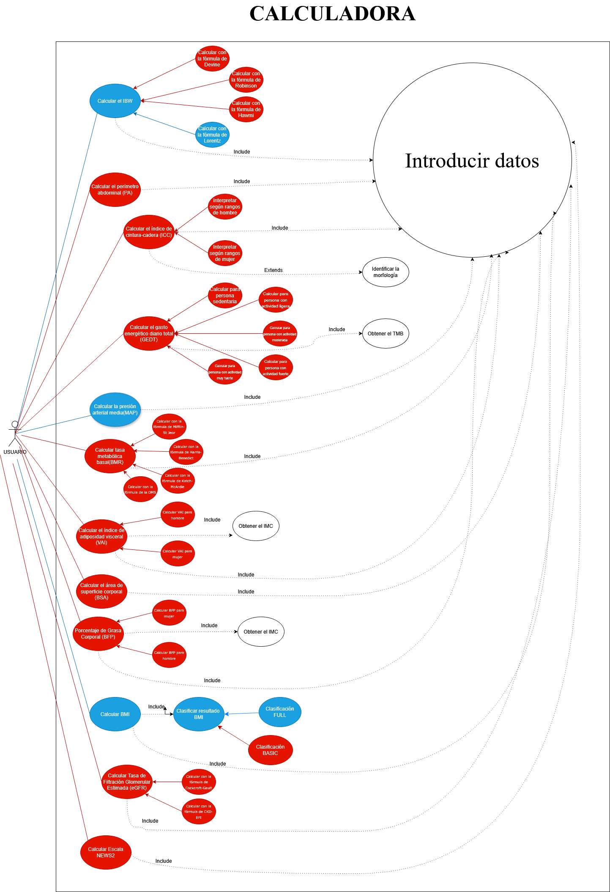

# HealthCalc
Bienvenido al proyecto de la asignatura de **Ingeniería del Software Avanzada**.

El [Hospital Universitario Virgen de la Victoria (El Clínico)](https://www.sspa.juntadeandalucia.es/servicioandaluzdesalud/hospital/virgen-victoria/) de Málaga nos ha encargado el desarrollo de una **Calculadora de Salud** (**_HealthCalc_**) que permita calcular diferentes métricas de los pacientes.

## Requisitos  

<b>Requisitos Funcionales</b>

- La calculadora debe dar soporte a al menos tres métricas.

<b>Requisitos No Funcionales</b>

Para que el proyecto cumpla con estándares de software médico, se deben incluir:
- **Gestión de Errores:** Manejo de excepciones en divisiones por cero (ej. altura 0 en IMC).
  1.  **Validación de Rangos (_Data Scrubbing_):**
      * *Hard Limits:* Bloquear entradas imposibles (ej. altura de 4 metros).
      * *Soft Limits:* Avisos ante valores inusuales pero posibles.
    
        > **Límites Biológicos Reales**:
            * **Altura:** El ser humano más alto registrado midió aproximadamente 272 cm. Un límite de 300 cm es un "Hard Limit" sensato.
            Un recién nacido puede medir 40cm. Un límite inferior sensato es de 30cm.
            * **Peso:** El peso máximo registrado ronda los 635 kg. Un límite de 700 kg sería el tope lógico.
            Un recién nacido puede pesar 2kg. Un límite inferior sensato es de 1kg.
  2.  **Soporte Multi-unidad:** Conversión automática entre sistema métrico (kg, cm) e imperial (lb, ft/in).
  3.  **Gestión de Errores:** Manejo de excepciones en divisiones por cero (ej. altura 0 en IMC).
- Todo el código de la aplicación (incluido los comentarios) deben estar en inglés.
- **Privacidad (_Compliance_):** Si el software almacena datos, debe considerar la anonimización de la Información Personal Identificable (PII) bajo normativas como GDPR o HIPAA.

## Métricas de HealthCalc

<b>Métricas Antropométricas</b>

* **M1: Índice de Masa Corporal (IMC) o _Body Mass Index (BMI)_:** El IMC es es un indicador estándar, adoptado por la [Organización Mundial de la Salud (OMS)](https://www.who.int/es), que evalúa la adecuación del peso de una persona en relación con su altura para estimar la grasa corporal.

    * **Fórmula:** $IMC = \frac{\text{peso (kg)}}{\text{altura (m)}^2}$

    El IMC nos permite clasificar el estado nutricional de una persona en categorías. La OMS ha definido la siguiente clasificación estándar del estado nutricional en adultos:

      - Bajo peso ($<18.5$)
      - Normal ($18.5-24.9$)
      - Sobrepeso ($25-29.9$)
      - Obesidad ($\ge 30$)

---

* **M2: Peso Corporal Ideal (PCI) o _Ideal Body Weight (IBW)_:** El PCI estima el peso teórico que se asocia con el menor riesgo de mortalidad y una mejor salud para un persona.

    Existen diferentes fórmulas para calcular el PCI:

    1. **Fórmula de Devine (1974)**
    Es la más extendida en entornos clínicos para ajustar dosis de medicamentos.

        - **Hombres:** 50 kg + [2.3 × (estatura en pulgadas - 60)]
        - **Mujeres:** 45.5 kg + [2.3 × (estatura en pulgadas - 60)]

    2. **Fórmula de Robinson (1983)**
    Es una variante de Devine más precisa, dando valores más bajos en mujeres y más altos en hombres. 

        - **Hombres:** 52 kg + [1.9 × (estatura en pulgadas - 60)]
        - **Mujeres:** 49 kg + [1.7 × (estatura en pulgadas - 60)]

    3. **Fórmula de Hamwi (1964)**
    Fórmula clásica utilizada por dietistas y nutricionistas debido a su sencillez.

        - **Hombres:** 48.1 kg + [2.7 × (estatura en pulgadas - 60)]
        - **Mujeres:** 45.4 kg + [2.2 × (estatura en pulgadas - 60)]

    4. **Fórmula de Lorentz (1929)**
    Es la fórmula más sencilla de aplicar manualmente ya que utiliza directamente la estatura en centímetros y no requiere conversiones a pulgadas.

        - **Hombres:** $PCI = (Estatura en cm - 100) - \frac{Estatura - 150}{4}$
        - **Mujeres:** $PCI = (Estatura en cm - 100) - \frac{Estatura - 150}{2}$

    **Nota:** Para convertir la estatura de **cm a pulgadas**, hay que dividir los centímetros entre **2.54**.

---

* **M3: Área de Superficie Corporal (ASC) o _Body Surface Area (BSA)_:** El ASC es una medida clínica utilizada para calcular dosis precisas de medicamentos, especialmente en quimioterapia y fluidos intravenosos, y para evaluar la severidad de quemaduras.

    La fórmula más común es la de **Mosteller**:

    * **Fórmula (Mosteller):** $BSA = \sqrt{\frac{\text{altura (cm)} \times \text{peso (kg)}}{3600}}$    

---

* **M4: Perímetro Abdominal (PA) o _Waist Circumference_ (WC):** Es la medición lineal de la circunferencia de la cintura. Se considera el indicador clínico directo de grasa visceral más sencillo y aceptado para predecir obesidad abdominal.
  
    * **Valores de Referencia (Riesgo Elevado):**  
      - **Hombres:** $\ge 94\text{ - }102 \text{ cm}$  
      - **Mujeres:** $\ge 80\text{ - }88 \text{ cm}$

---

* **M5: Índice de Cintura-Cadera (ICC) o _Waist-to-Hip Ratio_ (WHR):** Es ICC la relación entre el perímetro de la cintura y el de la cadera. Se utiliza para identificar la distribución de la grasa (cuerpo tipo "manzana" o "pera") y estimar el riesgo de enfermedades cardiovasculares.
  
    * **Fórmula:** $ICC = \frac{\text{Circunferencia de cintura (cm)}}{\text{Circunferencia de cadera (cm)}}$
    * **Valores de Riesgo (OMS):**  
        - **Hombres:** $> 0.90$  
        - **Mujeres:** $> 0.85$

    Tipos de Morfología:

    1.  **Cuerpo en forma de Manzana (Androide):**
        * **Definición:** La grasa se acumula principalmente en la zona abdominal (tronco).
        * **Implicación Clínica:** Mayor riesgo de hipertensión, diabetes tipo 2 y enfermedades cardíacas debido a la cercanía de la grasa a los órganos vitales (grasa visceral).
        * **Criterio:** Se asigna si el ICC supera los límites de la OMS (>0.90 en hombres, >0.85 en mujeres).

    2.  **Cuerpo en forma de Pera (Ginoide):**
        * **Definición:** La grasa se almacena mayoritariamente en la cadera, glúteos y muslos.
        * **Implicación Clínica:** Generalmente asociada a un menor riesgo metabólico que la forma de manzana, aunque puede relacionarse con problemas articulares o varices.
        * **Criterio:** Se asigna si el ICC está dentro de los rangos normales o bajos.

    | Sexo | Rango ICC | Categoría Morfológica | Riesgo de Salud |
    | :--- | :--- | :--- | :--- |
    | **Hombre** | $\le 0.90$ | Pera (Ginoide) | Bajo / Moderado |
    | **Hombre** | $> 0.90$ | **Manzana (Androide)** | **Alto** |
    | **Mujer** | $\le 0.85$ | Pera (Ginoide) | Bajo / Moderado |
    | **Mujer** | $> 0.85$ | **Manzana (Androide)** | **Alto** |

<b>Métricas Metabólicas y Nutricionales</b>

* **M6: Tasa Metabólica Basal (TMB) o _Basal Metabolic Rate (BMR)_:** El TMB calcula la cantidad mínima de energía (calorías) que el cuerpo necesita en reposo absoluto. 

    Existen diferentes fórmulas para calcular el PCI:

    1. **Ecuación de Mifflin-St Jeor**
    Es actualmente la más precisa para la población general y la que utilizan la mayoría de calculadoras modernas. 

        - **Hombres:**  `TMB = (10 × peso en kg) + (6.25 × altura en cm) - (5 × edad en años) + 5`
        - **Mujeres:**  `TMB = (10 × peso en kg) + (6.25 × altura en cm) - (5 × edad en años) - 161`

    2. **Ecuación de Harris-Benedict (revisada)**
    Es el método clásico. La versión original de 1919 fue revisada en 1984 por Roza y Shizgal para mejorar su exactitud.

        - **Hombres:**  `TMB = 88.362 + (13.397 × peso en kg) + (4.799 × altura en cm) - (5.677 × edad en años)`
        - **Mujeres:**  `TMB = 447.593 + (9.247 × peso en kg) + (3.098 × altura en cm) - (4.330 × edad en años)`

    3. **Ecuación de Katch-McArdle**
    A diferencia de las anteriores, esta fórmula no distingue entre sexos, sino que utiliza la Masa Corporal Magra (peso sin grasa). Es ideal si conoces tu porcentaje de grasa corporal.
        - `TMB = 370 + (21.6 × Masa Corporal Magra en kg)`
            > **Nota:** Masa Magra = Peso total × (1 - % de grasa decimal)

    4. **Ecuación de la OMS (FAO/WHO/UNU)**
    Utilizada a menudo en estudios de salud pública, divide el cálculo por rangos de edad específicos: 

        | Edad (Años) | Hombres | Mujeres |
        | :--- | :--- | :--- |
        | **18 – 30** | `(15.057 × peso) + 692.2` | `(14.818 × peso) + 486.6` |
        | **30 – 60** | `(11.472 × peso) + 873.1` | `(8.126 × peso) + 845.6` |
        | **> 60** | `(11.711 × peso) + 587.7` | `(9.082 × peso) + 658.5` |

---

* **M7: Gasto Energético Diario Total (GEDT) o _Total Daily Energy Expenditure (TDEE)_:** El TDEE es la cantidad total de calorías que el cuerpo quema en 24 horas. Suma el metabolismo basal (funciones vitales en reposo), la actividad física, la digestión y el movimiento cotidiano. Es esencial para ajustar la nutrición (perder, ganar o mantener peso).

    Para obtener las calorías totales que quemas al día, multiplica tu **TMB** por tu nivel de actividad:

    - **Sedentario** (poco/nada de ejercicio): `TMB × 1.2`
    - **Ligero** (ejercicio 1-3 días/semanas): `TMB × 1.375`
    - **Moderado** (ejercicio 3-5 días/semana): `TMB × 1.55`
    - **Fuerte** (ejercicio 6-7 días/semana): `TMB × 1.725`
    - **Muy fuerte** (atleta o trabajo físico pesado): `TMB × 1.9`

<b>Métricas Clínicas, Cardiovasculares, y de Función Orgánica</b>

Estas métricas requieren datos de signos vitales o resultados de laboratorio.

* **M8: Presión Arterial Media (PAM) o _Mean Arterial Pressure_ (MAP):** Representa la presión promedio en las arterias de un paciente durante un ciclo cardíaco completo. Se considera un mejor indicador de la perfusión (entrega de sangre) a los órganos vitales que la presión sistólica por sí sola. Un valor mínimo de 60-65 mmHg es necesario para mantener los órganos sanos.
  
    **Fórmula:** $PAM = \frac{PAS + 2(PAD)}{3}$  
    *(Donde PAS = Presión Arterial Sistólica y PAD = Presión Arterial Diastólica)*.

--- 

* **M9: Índice de Adiposidad Visceral (VAI) o _Visceral Adiposity Index_ (VAI):** Es un indicador empírico que estima la función del tejido adiposo visceral y el riesgo cardiometabólico. Combina medidas físicas (IMC y CC) con parámetros lipídicos (Triglicéridos y HDL).
  
    **Fórmulas:**  
        - **Hombres:** $VAI = \left( \frac{CC}{39.68 + (1.88 \times IMC)} \right) \times \left( \frac{TG}{1.03} \right) \times \left( \frac{1.31}{HDL} \right)$  
        - **Mujeres:** $VAI = \left( \frac{CC}{36.58 + (1.89 \times IMC)} \right) \times \left( \frac{TG}{0.81} \right) \times \left( \frac{1.52}{HDL} \right)$  
    *(Donde CC = Circunferencia de Cintura en cm, TG = Triglicéridos y HDL en mmol/L)*.

--- 

* **M10: Tasa de Filtración Glomerular Estimada (eGFR) o _Estimated Glomerular Filtration Rate_ (eGFR):** Es el "estándar de oro" para evaluar qué tan bien están filtrando la sangre los riñones. Es vital para la detección de la Enfermedad Renal Crónica (ERC) y para ajustar dosis de fármacos.
  
    **Fórmulas Comunes:**  
      * **Cockcroft-Gault (Clásica):** $\frac{(140 - \text{edad}) \times \text{peso}}{72 \times \text{creatinina}} \times (0.85 \text{ si es mujer})$.  
      * **CKD-EPI (Moderna):** Utiliza logaritmos y variables de raza/sexo para mayor precisión (es la recomendada actualmente en software clínico).  
    * **Entradas necesarias:** Creatinina sérica (mg/dL), edad, sexo y etnia.  

--- 

* **M11: Escala NEWS2 o _National Early Warning Score 2_:** Es un sistema de puntuación estandarizado para detectar el deterioro clínico agudo en pacientes adultos. En lugar de una fórmula aritmética simple, es un **sistema de puntos acumulativo** basado en rangos fisiológicos.
  
    **Parámetros Evaluados (7):**
      1. Frecuencia respiratoria.
      2. Saturación de oxígeno.
      3. Uso de oxígeno suplementario (Sí/No).
      4. Presión arterial sistólica.
      5. Frecuencia cardíaca (Pulso).
      6. Nivel de conciencia (Escala ACVPU).
      7. Temperatura.
    * **Lógica de Software:** El sistema suma puntos (0 a 3) por cada parámetro que se desvíe de lo normal. Un puntaje de 5 o más es una "Alerta Roja" que requiere respuesta urgente.

## Plan de pruebas

Para garantizar que la calculadora sea fiable y segura, se han definido los siguientes casos de prueba divididos por categorías:

<b>Pruebas de Cálculo del Índice de Masa Corporal (IMC o BMI)</b>

* **Cálculo correcto:** Se comprueba que, al introducir un peso y altura normales, el resultado sea el esperado matemáticamente.
* **Protección ante datos imposibles:**
    * El sistema debe rechazar pesos menores a 1 kg o mayores a 700 kg.
    * El sistema debe rechazar alturas menores a 30 cm o mayores a 300 cm.
* **Protección ante errores de escritura:** Se verifica que no se permitan valores negativos o iguales a cero.

<b>Pruebas de Cálculo del Peso Ideal a través de la fórmula de Lorentz (IBW)</b>

* **Cálculo correcto:** Se comprueba que, al introducir una altura normal y al seleccionar un sexo válido (Hombre o Mujer), el resultado sea el esperado matemáticamente.
* **Protección ante datos imposibles:**
    * El sistema debe rechazar alturas menores a 150 cm o mayores a 300 cm.
    * El sistema debe rechazar un sexo distinto de Hombre o Mujer.
* **Protección ante errores de escritura:** Se verifica que no se permitan valores negativos, decimales o iguales a cero en la altura. De la misma manera, se verifica que no se permitan valores nulos, incorrectos o vacios en el sexo.

<b>Pruebas de Clasificación del Estado de Salud basado en el IMC/BMI</b>

Para cada categoría, probamos valores que están justo en el límite para asegurar que el cambio de etiqueta es exacto:  

* **Peso bajo (Underweight):** Se comprueba con valores por debajo de 18.5.
* **Peso normal (Normal weight):** Se comprueba con valores desde 18.5 hasta justo antes de 25.
* **Sobrepeso (Overweight):** Se comprueba con valores desde 25 hasta justo antes de 30.
* **Obesidad (Obesity):** Se comprueba con valores desde 30 en adelante.
* **Seguridad:** Se rechazan clasificaciones para resultados de IMC negativos o absurdamente altos (más de 150).

### Casos de prueba - BMI (Body Mass Index) - Versión FULL

<b>Pruebas de Cálculo del BMI - Versión FULL</b>

El **Índice de Masa Corporal (BMI)** en su versión **FULL** permite una clasificación detallada del estado nutricional siguiendo los criterios de la OMS. Se calcula mediante la fórmula: $BMI = \frac{\text{Peso (kg)}}{\text{Altura (m)}^2}$ .

* **Cálculo estándar:**
    * **Entrada:** Valores de peso y altura dentro del rango biológico normal.
    * **Ejemplo:** Peso = 85.0 kg, Altura = 1.80 m.
    * **Resultado esperado:** 26.23 (aproximadamente).

* **Entrada de Valores No Válidos:**
    * **Entrada:** Valores fuera del rango biológico establecido $[0,150]$.
    * **Ejemplos de prueba:** BMI = -5.0, BMI= 160.0.
    * **Resultado esperado:** El sistema debe lanzar **InvalidHealthDataException**, ya que no existen valores biológicos fuera de este rango.

* **Inconsistencia de Datos de Entrada:**
    * **Entrada:** Peso inferior a $1$ kg o superior a $700$, y altura inferior a $0.30$ m o superior a $3.00$ m.
    * **Ejemplos de prueba:** Peso = 0.5 kg, Altura = 0.20 m.
    * **Resultado esperado:** El sistema debe lanzar **InvalidHealthDataException** por superar los límites biológicos reales de un ser humano. 
         

<b>Pruebas de Clasificación del Estado de Salud basado en el BMI - Versión FULL</b>

Una vez obtenido un BMI válido, se clasifica el estado de salud del paciente.

* **Clasificación de Delgadez:**
    * **Entrada:** BMI inferior a $18.5$.
    * **Ejemplos de prueba:**
        * BMI = 15.5, el resultado debe ser "Severe thinness".
        * BMI = 16.5, el resultado debe ser "Moderate thinness".
        * BMI = 17.5, el resultado debe ser "Mild thinness".

* **Rango Saludable y Sobrepeso:**
    * **Entrada:** BMI en el intervalo $[18.5, 30.0)$.
    * **Ejemplo de prueba:**
        * BMI = 22.0, el resultado debe ser "Normal weight".
        * BMI = 27.5, el resultado debe ser "Overweight".

* **Clasificación de Obesidad:**
    * **Entrada:** BMI mayor o igual a $30.0$.
    * **Ejemplos de prueba:**
        * BMI = 32.0, el resultado debe ser "Obese Class I (Moderate)".
        * BMI = 37.0, el resultado debe ser "Obese Class II (Severe)".
        * BMI = 45.0, el resultado debe ser "Obese Class III (Morbid)".

### Casos de Prueba - Presión Arterial Media (MAP)

<b>Pruebas de Cálculo del MAP</b>

La **Presión Arterial Media (MAP)** representa la presión promedio en las arterias durante un ciclo cardíaco completo. Se calcula mediante la fórmula: $$MAP = \frac{PAS + 2(PAD)}{3}$$

* **Cálculo estándar:**
    * **Entrada:** Valores de presiones habituales (PAS: 100-140, PAD: 60-90).
    * **Ejemplo:** PAS = 120, PAD = 80.
    * **Resultado esperado:** 93.33 mmHg.
* **Entradas de Valores No Válidos:**
    * **Entrada:** Valores negativos o iguales a cero.
    * **Ejemplo:** PAS = -120, PAD = 0.
    * **Resultado esperado:** Excepción/Error (InvalidHealthDataException).
* **Inconsistencia Biológica:**
    * **Entrada:** Presión Diastólica mayor o igual a la Sistólica.
    * **Ejemplo:** PAS = 70, PAD = 110.
    * **Resultado esperado:** Excepción/Error.
* **Límites Físicos:**
    * **Entrada:** Valores que superan los límites de la supervivencia humana.
    * **Ejemplo:** PAS = 350, PAD = 220.
    * **Resultado esperado:** Excepción/Error.

<b>Pruebas de Clasificación del Estado de Perfusión (MAP)</b>

A partir del valor numérico obtenido, el sistema categoriza el estado del paciente:

* **MAP Low (Baja):**
    * **Rango:** Valores menores a 70 mmHg.
    * **Resultado esperado:** "Low".
* **MAP Normal (Saludable):**
    * **Rango:** Valores entre 70 y 100 mmHg (inclusive).
    * **Resultado esperado:** "Normal".
* **MAP High (Alta):**
    * **Rango:** Valores mayores a 100 mmHg.
    * **Resultado esperado:** "High".

## Práctica 6: Patrones de Diseño

### Patrón Singleton
Se aplica sobre `HealthCalcImpl` para garantizar que solo exista una única instancia de la calculadora en toda la aplicación. El constructor es privado y se accede a la instancia mediante el método estático `getInstance()`. Tanto `MainP1` como `HealthCalcControlador` (interfaz gráfica) obtienen la calculadora a través de este método.

### Patrón Adapter
Permite que el hospital utilice nuestra calculadora a través de su interfaz (`HealthHospital`). Como son incompatibles, se ha creado HealthHospitalAdapter para traducir sus unidades (gramos y metros) a las nuestras y devolviendo los resultados mediante una clase Tuple.

### Patrón Proxy
Su función principal es registrar estadísticas de uso (alturas medias, pesos, etc.) de forma anónima mediante la interfaz `HealthStats` antes de delegar el cálculo real al adaptador.

### Patrón Decorator
Añade comportamiento extra a la calculadora del hospital sin modificarla. Se han creado dos versiones concretas que extienden la clase abstracta `HealthCalcDecorator`:
- **`HealthCalcEuropeDecorator`**: acepta altura en metros y peso en gramos, e imprime el resultado del IMC en español e inglés.
- **`HealthCalcAmericaDecorator`**: acepta altura en pies y peso en libras, convierte internamente las unidades, e imprime igualmente el resultado en ambos idiomas.

### Diagrama combinado de todos los patrones

El siguiente diagrama muestra cómo los cuatro patrones se integran en una única cadena de llamadas:

> `MainP1` → `HealthCalcDecorator` → `HealthHospitalProxy` → `HealthHospitalAdapter` → `HealthCalcImpl` (Singleton)

## Práctica 7: Refactorings

### REFACTORING 1: Introduce Parameter Object (Person)

**(1) Bad smell:** Data Clumps – weight, height y gender se pasaban como parámetros sueltos a bmi() e ibw().

**(2) Refactoring aplicado:** Introduce Parameter Object.

**(3) Categoría:** Class refactoring.

**(4) Descripción:** Se ha creado la clase PersonImpl para agrupar los datos de la persona (weight, height, gender, age) que antes se pasaban como parámetros primitivos a los métodos de cálculo.

**(5) Cambios manuales:** 1 clase nueva (PersonImpl) con 4 atributos y constructor.

---

### REFACTORING 2: Replace Type Code with Enum (Gender)

**(1) Bad smell:** Primitive Obsession / Type Code – género representado como String "hombre"/"mujer".

**(2) Refactoring aplicado:** Replace Type Code with Enum.

**(3) Categoría:** Class refactoring (introducción de tipo).

**(4) Descripción:** Se ha creado la enum Gender con valores FEMALE y MALE para sustituir los String que se usaban para representar el sexo.

**(5) Cambios manuales:** 1 enum nueva (Gender) con 2 valores.

---

### REFACTORING 3: Encapsulate Field (atributos de PersonImpl)

**(1) Bad smell:** Public Fields / falta de encapsulación.

**(2) Refactoring aplicado:** Encapsulate Field.

**(3) Categoría:** Attribute refactoring.

**(4) Descripción:** Se han hecho privados los atributos de PersonImpl y se han añadido métodos de acceso para respetar el principio de encapsulación.

**(5) Cambios manuales:** 0 (lo hace la IDE automáticamente sobre 4 campos).

---

### REFACTORING 4: Rename Method (getters de PersonImpl)

**(1) Bad smell:** Inconsistent Naming – los getters generados se llamaban getWeight, getHeight… pero el esquema UML exige weight(), height(), gender(), age().

**(2) Refactoring aplicado:** Rename Method.

**(3) Categoría:** Method refactoring.

**(4) Descripción:** Se han renombrado los métodos getWeight→weight, getHeight→height, getGender→gender, getAge→age para alinearlos con la interfaz del esquema.

**(5) Cambios manuales:** 0 (lo hace la IDE en cascada sobre 4 métodos).

---

### REFACTORING 5: Extract Interface (Person)

**(1) Bad smell:** Acoplamiento a clase concreta – los clientes dependerían de PersonImpl.

**(2) Refactoring aplicado:** Extract Interface.

**(3) Categoría:** Class refactoring.

**(4) Descripción:** Se ha extraído la interfaz Person a partir de PersonImpl, con los métodos weight(), height(), gender() y age(). Permite que los clientes dependan de la abstracción.

**(5) Cambios manuales:** 0 (la IDE genera la interfaz y modifica PersonImpl).

---

### REFACTORING 6: Extract Interface (BasalMetabolicIndex) + Replace Type Code with Enum (BMICategory)

**(1) Bad smell:** God Class – HealthCalcImpl agrupa BMI + IBW + MAP. Primitive Obsession en el tipo de retorno de la clasificación (String en vez de enum).

**(2) Refactoring aplicado:** Extract Interface + Replace Type Code with Enum.

**(3) Categoría:** Class refactoring.

**(4) Descripción:** Se ha extraído la interfaz BasalMetabolicIndex con los métodos basalMetabolicIndex(Person) y category(Person), y se ha creado la enum BMICategory con las 8 categorías OMS. HealthCalcImpl ahora implementa también esta nueva interfaz.

**(5) Cambios manuales:** 2 archivos nuevos (interfaz + enum), 1 línea de declaración modificada en HealthCalcImpl y 2 métodos nuevos añadidos.

---

### REFACTORING 7: Extender Person con PAS y PAD

**(1) Bad smell:** Insufficient Data in Abstraction – Person no contiene toda la información necesaria para que la métrica MAP encaje en el esquema OtraMétrica.m(person).

**(2) Refactoring aplicado:** Add Field a interfaz y a clase.

**(3) Categoría:** Class refactoring (extensión de interfaz y clase).

**(4) Descripción:** Se han añadido los métodos systolicPressure() y diastolicPressure() a la interfaz Person y los atributos correspondientes a PersonImpl, junto con un constructor corto y otro completo.

**(5) Cambios manuales:** 2 firmas nuevas en la interfaz, 2 atributos nuevos, 2 getters nuevos y 1 constructor adicional en PersonImpl.

---

### REFACTORING 8: Extract Interface (OtraMetrica) + Replace Type Code with Enum (MAPCategory)

**(1) Bad smell:** God Class en HealthCalcImpl (hacía el cálculo de MAP también) y Primitive Obsession en mapClassification (devolvía un String en lugar de un Enum).

**(2) Refactoring aplicado:** Extract Interface + Replace Type Code with Enum.

**(3) Categoría:** Class refactoring.

**(4) Descripción:** Se ha extraído la lógica de la presión arterial a una nueva interfaz OtraMetrica y se ha creado un enum MAPCategory para los niveles de perfusión.

**(5) Cambios manuales:** 2 archivos nuevos creados (OtraMetrica y MAPCategory), 2 métodos modificados en HealthCalcImpl y 1 línea de declaración modificada (implements OtraMetrica).

---

### REFACTORING 9: Extract Interface (IdealBodyWeight)

**(1) Bad smell:** God Class – HealthCalcImpl agrupa BMI + IBW + MAP sin separación de responsabilidades, y acoplamiento a clase concreta.

**(2) Refactoring aplicado:** Extract Interface.

**(3) Categoría:** Class refactoring.

**(4) Descripción:** Se ha extraído la interfaz IdealBodyWeight con el método idealBodyWeight(Person), siguiendo el mismo patrón que BasalMetabolicIndex y OtraMetrica. HealthCalcImpl ahora implementa también esta nueva interfaz.

**(5) Cambios manuales:** 1 archivo nuevo (interfaz IdealBodyWeight), 1 línea de declaración modificada en HealthCalcImpl y 1 método nuevo añadido.

## Instalación y ejecución

<b>Python</b>

### Dependencias
- Python 3.13+
- pytest
- coverage
- pytest-cov

### Preparación del entorno
1. Clonar este repositorio: `git clone https://github.com/IngSoftAvanz/healthcalc.git`
2. Desplazarse a la carpeta del proyecto:
   `cd healthcalc/python-project-healthcalc`
3. Crear entorno virtual: `python -m venv env` (esto crea una carpeta `env` para el entorno virtual)
4. Activar el entorno virtual:
    - En Windows: `.\env\Scripts\Activate`
    - En Linux: `. env/bin/activate`
5. Instalar dependencias: `pip install -r requirements.txt`

### Ejecución
- Ejecutar la aplicación: `python main.py <número>`
- Ejecutar los tests: `pytest -v`
- Ejecutar los tests con informe de cobertura: `pytest -v --cov=factorial --cov-report=html tests/`

<b>Java</b>

### Dependencias
- Java JDK 18+
- Maven
- JUnit
- Jacoco
  
### Preparación del entorno
1. Clonar este repositorio: `git clone https://github.com/IngSoftAvanz/healthcalc.git`
2. Desplazarse a la carpeta del proyecto:
   `cd healthcalc/java-project-healthcalc`
3. Compilar con Maven: `mvn clean compile`

### Ejecución
- Ejecutar la aplicación: Clic en Run usando el IDE.
- Ejecutar los tests: Clic en Run Tests usando el IDE o con Maven: `mvn test`
- Ejecutar los tests con informe de cobertura (previamente configurado en pom.xml): `mvn test`

## Especificación

### Casos de uso 
Diagrama de casos de uso de la calculadora de salud. Los casos de uso implementados en la Práctica 1 se muestran en **azul** y en **rojo** los que no.

#### Enlaces a la documentación de los Casos de Uso:
* [Especificación Caso de Uso 1: BMI (Versión Full)](./doc/CU_BMI.txt)
* [Especificación Caso de Uso 2: IBW](./doc/CU_IBW.txt)
* [Especificación Caso de Uso 3: MAP](./doc/CU_MAP.txt)